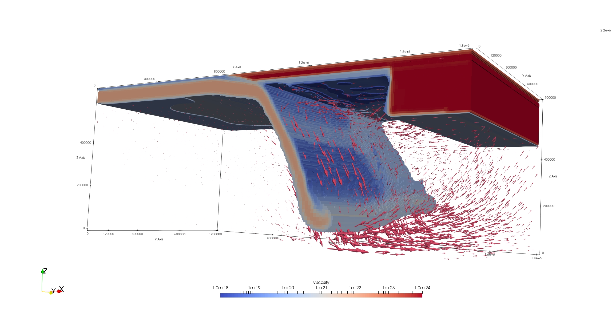
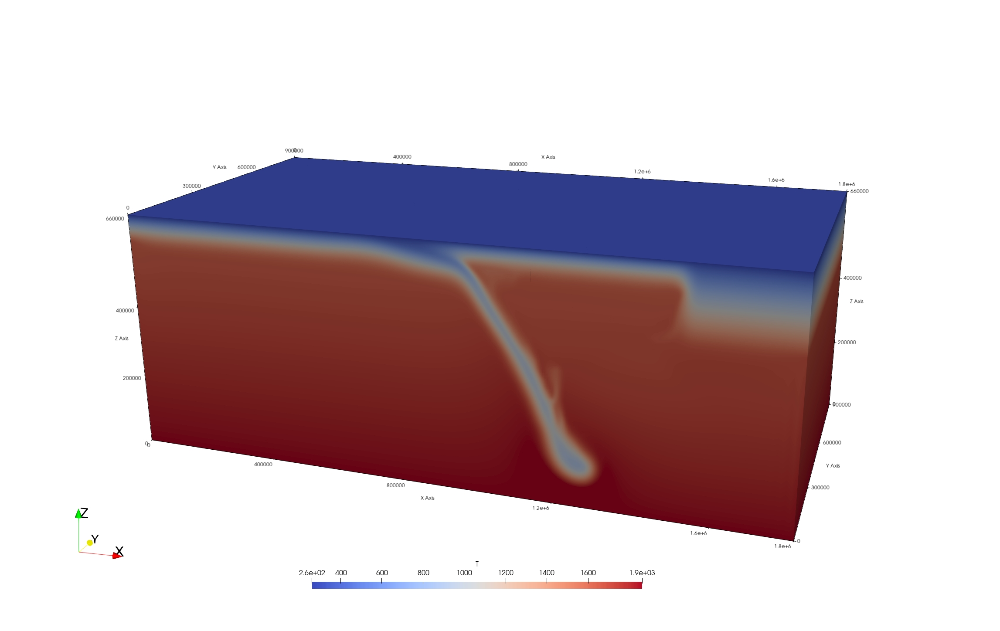
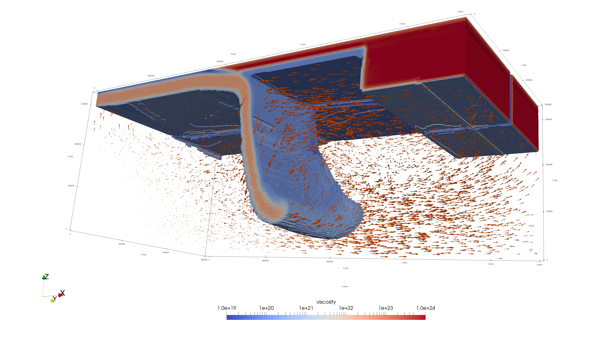

# ASPECT Subduction Modeling

This repository contains numerical modelling workflows for studying subduction dynamics, mantle flow, lithosphere evolution, thermal structure, and rheological structure using ASPECT.

## Project Overview

The project focuses on geodynamic simulations of oceanic subduction and its interaction with overriding continental lithosphere. The models are designed to investigate how slab geometry, mantle viscosity, thermal structure, and lithospheric rheology influence subduction evolution and mantle flow patterns.

## Tools and Methods

- ASPECT for numerical geodynamic modelling
- ParaView for visualization of model outputs
- Python for post-processing and plotting
- MATLAB for additional analysis
- HPC/Slurm workflows for running large simulations

## Example Results

### Small-Scale Convection Model (Velocity Field)



Velocity field showing the development of small-scale convection (SSC) beneath the lithosphere in a weakened zone (1e18 Pa·s) within an isoviscous mantle (1e20 Pa·s). The flow pattern highlights interaction between subduction-driven poloidal flow and convective instabilities.

### Small-Scale Convection Model (Temperature Field)



Temperature field showing the slab thermal structure and localized mantle instability region at 4 Myr. This complements the velocity visualization by showing where the thermal and rheological structure supports small-scale convection.

### Slab-Edge Toroidal Flow Model (Bottom View Velocity Field, 8 Myr)



Bottom-view velocity field at 8 Myr showing toroidal mantle flow around the slab edge. The lateral flow pattern highlights how finite slab geometry can generate 3D mantle circulation around the edge of the subducting plate.


## Repository Structure

```text
input-files/        ASPECT parameter files
postprocessing/     Python or MATLAB scripts
figures/            Example plots and visualizations
notes/              Short documentation and model notes
```
