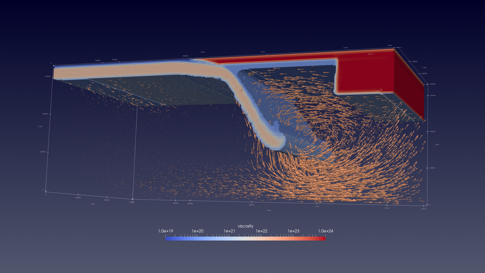
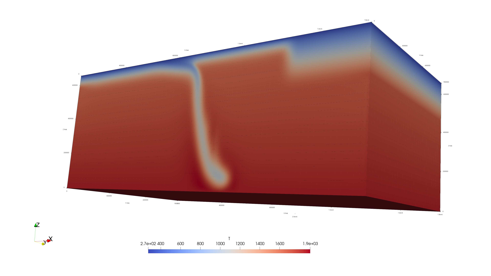

# ASPECT Subduction Modeling

This repository contains numerical modelling workflows for studying subduction dynamics, mantle flow, lithosphere evolution, thermal and rheological structure using ASPECT.

## Project Overview

The project focuses on geodynamic simulations of oceanic plate subducting underneath an overriding continental plate with a thick cratonic root towards the continental side in place. The models are designed to investigate how slab geometry, mantle viscosity, thermal structure, and lithospheric rheology influence subduction evolution and mantle flow patterns.

## Scientific Highlights

This repository investigates mantle flow dynamics through progressively complex geodynamic models:

- A baseline subduction model establishes reference poloidal flow
- A weak-zone model introduces small-scale convection (SSC)
- A finite slab model generates toroidal flow around slab edges

Together, these models isolate and compare key mantle flow mechanisms:
poloidal flow, small-scale convection, and toroidal circulation.

## Tools and Methods

- ASPECT for numerical geodynamic modelling
- ParaView for visualization of model outputs
- Python for post-processing and plotting
- MATLAB for additional analysis
- HPC/Slurm workflows for running large simulations

## Example Results

### Simple Subduction Model with Poloidal Flow and Edge-Driven_Flow (Velocity Field, 3 Myr)



Velocity field for the 3D simple subduction model with an isoviscous mantle viscosity of 1e20 Pa·s. This model provides the reference poloidal flow and edge-driven-flow pattern before adding localized low viscosity back-arc mantle.

### Simple Subduction Model with Small-Scale Convection Flow (Velocity Field, 4 Myr)


Velocity field showing the development of small-scale convection (SSC) beneath the lithosphere in a weakened zone (1e18 Pa·s) within an isoviscous mantle (1e20 Pa·s). The flow pattern highlights interaction between subduction-driven poloidal flow and convective instabilities.

### Small-Scale Convection Model (Temperature Field, 4 Myr)


Temperature field showing the slab thermal structure and localized mantle instability region at 4 Myr. This complements the velocity visualization by showing where the thermal and rheological structure supports small-scale convection.

### Slab-Edge Toroidal Flow Model (Velocity Field, 8 Myr)


Velocity field at 8 Myr showing toroidal mantle flow around the slab edge. The lateral flow pattern highlights how finite slab geometry can generate 3D mantle circulation around the edge of the subducting plate.

### Slab-Edge Toroidal Flow Model (Temperature Field, 8 Myr)



Temperature field at 8 Myr illustrating the thermal structure of the subducting slab and surrounding mantle in a finite slab geometry. The cold, high-viscosity slab contrasts with the warmer ambient mantle, clearly outlining slab morphology and its lateral extent. The temperature distribution highlights how slab edges introduce thermal gradients that can influence mantle flow patterns and promote three-dimensional circulation, complementing the toroidal flow observed in the velocity field.

## Summary

This repository demonstrates the design and analysis of geodynamic models to isolate and compare key mantle flow mechanisms, including poloidal flow, small-scale convection (SSC), and slab-edge toroidal circulation.

The models are constructed to explore how variations in geometry and rheology influence mantle dynamics, with a focus on developing physical intuition and quantitative understanding of subsurface flow processes.

## Note

Detailed model configurations and extended simulation datasets are part of ongoing research work and are not fully included here. Selected examples are provided to illustrate modelling approach, analysis, and interpretation.


## Repository Structure

```text
input-files/        ASPECT parameter files
postprocessing/     Python or MATLAB scripts
figures/            Example plots and visualizations
notes/              Short documentation and model notes
```
